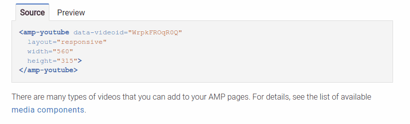

# How to: Include embedded samples in AMP docs

This document describes how to include embedded samples in [www.ampproject.org](http://www.ampproject.org)
documents, like the ones in the [Create Responsive AMP
pages](https://www.ampproject.org/docs/guides/responsive/responsive_design#example:-embedding-a-youtube-video)
guide.




## Prerequisites

*   Install [NodeJS](https://nodejs.org/)
*   Install [Gulp](http://gulpjs.com/)
*   A test site to host your samples 

## Process

To include embedded samples in an [ampproject.org](https://www.ampproject.org/)
document, you'll need to do this in two parts:

1.  [Create sample embeds and push them to production so they are
    hosted.](#task-1-create-your-sample-code-and-generate-embeds)
1.  [Publish the document that contains the template code that points to the
    embedded sample.](#task-2-add-the-embedded-sample-to-your-document)

### Task 1: Create your sample code and generate embeds

1.  In your test site's directory, create an **examples/src** directory.
1.  In the **/examples/src** directory, create your sample source html file.
    *   The filename should be short and succinct (e.g., `ampimg.html`).
    *   The contents of the file should be formatted
        like [examples/src/responsive.html](https://github.com/ampproject/docs/blob/master/examples/src/responsive.html).
        Note that the comments in the file delimit the examples and are used as
        part of the generated file name.
    *   Images are stored in the `images/` subdirectory.
    *   Make sure the file is [valid AMP HTML](https://www.ampproject.org/docs/guides/validate).
1.  Create a **gulp** task to generate the sample snippets. For an example,
    see the ["build-examples"](https://github.com/ampproject/docs/blob/master/gulpfile.js#L16)
    task in ampproject's  gulpfile. The `amp-by-example` node module requires
    the following:
    *   `src`: the root folder containing the sample html file(s), which is set
        to the **example/src** directory.
    *  `destRoot`: the target folder to generate the embedded samples, which
        is set to the **build** directory
    *   `host`: the host URL of where the samples live, which is currently
        set to the **production** location of `https://ampproject-b5f4c.firebaseapp.com`.
        You should change this to your **test** host site.


    > **Important**: The samples cannot be on the same host domain as the actual
    > document that includes the embed. So, for production, the samples are hosted
    at `https://ampproject-b5f4c.firebaseapp.com` but the docs are available at
    `https://www.ampproject.org`.  It's a workaround because Firebase isn't easy
    to use for subdomains.  For testing, you can host your samples on a site,
    and run the docs locally.

    Here's a sample gulpfile.js that was used for testing on a staging site: 

    ```javascript
    const gulp = require('gulp');

    gulp.task('build-examples', function() {
      const expath = require('path');
      const abe = require('amp-by-example');
      const config = {
      src: expath.join(__dirname, 'examples/src'),  // root folder containing the samples
      destRoot: expath.join(__dirname, 'build'), // target folder for generated embeds 
      destDir: '/examples', // optional sub dir
      host: 'https://ampproject-staging.firebaseapp.com/' // from where the embeds are to be served
    }
      abe.generatePreview(config);
      gulp.src('./examples/src/images/*')
        .pipe(gulp.dest('build/examples/images/'));
    });
    ```

1.  Make sure your **[package.json](https://github.com/ampproject/docs/blob/master/package.json)**
    includes `amp-by-example` in the `devDependencies`.
1.  If this is your first time running the gulp task, make sure to install the
    dependencies (`npm i`).
1.  Run the gulp task (`gulp build-examples`).
1.  After successful running the gulp task, the following is generated in the
    `build/examples` directory:
    *  *`<srcfilename>`*.*`<commentname>`*.`template.html`: The snippet of code
        that you copy/paste into your document.
    *  *`<srcfilename>`*.*`<commentname>`*.`embed.html`: Embedded code snippet
        that's referenced by the template.
    *  *`<srcfilename>`*.*`<commentname>`*.`preview.html`: Embedded preview
        that's referenced by the template. 
    * `build/examples/images/*`: A copy of the examples/src/images directory. 

1.  Deploy the generated files to your test site, so you can validate that the
    snippet works correctly.  For example, we ran our gulp task with a host of
    `https://ampproject-staging.firebaseapp.com`, so if you go to https://ampproject-staging.firebaseapp.com/examples/responsive.basic-image.embed.html,
    you can see a working source/preview example.
1.  If everything is working correctly, then you're ready to post the examples
    to production:
    1.  Create a pull request to add your sample html file (and associated
        images) to [examples/src](https://github.com/ampproject/docs/tree/master/examples/src)
        ([Sample Pull request](https://github.com/ampproject/docs/pull/464)).
    1.  When your pull request is approved and merged into the **Production**
        branch, you will be able to access your example snippets at `https://ampproject-b5f4c.firebaseapp.com/examples/<filename>.html`.
        For example, https://ampproject-b5f4c.firebaseapp.com/examples/responsive.basic-image.embed.html. 

### Task 2: Add the embedded sample to your document

Now, that your sample is successfully hosted in production, you need to add the
snippet to your document.

1.  Add the code from the generated ***.template.html** file into your
    document, and wrap the code inside a `<div>` tag (otherwise, the document
    isn't valid AMP HTML).  Make sure the URL is pointing to the **production**
    host at `https://ampproject-b5f4c.firebaseapp.com`.

    *Example: An embedded sample demonstrating amp-img (hosted in production)*

    ```html
    <div>
      <amp-iframe height="193"
          layout="fixed-height"
          sandbox="allow-scripts allow-forms allow-same-origin"
          resizable
          src="https://ampproject-b5f4c.firebaseapp.com/examples/responsive.basic-image.embed.html">
        <div overflow tabindex="0" role="button" aria-label="Show more">Show full code</div>
        <div placeholder></div> 
      </amp-iframe>
    </div>
    ```

1.  [Build the ampproject site](https://github.com/ampproject/docs/blob/master/README.md)
    locally and verify that the embedded example appears correctly, and that the
    page is valid AMP HTML.
1.  Create a pull request to add your document to ampproject.org ([Sample Pull
    Request](https://github.com/ampproject/docs/pull/450/files#diff-b6a601e44c85912a896fa409685241ac)).
1.  After your PR is merged into Production, you'll see your changes!
