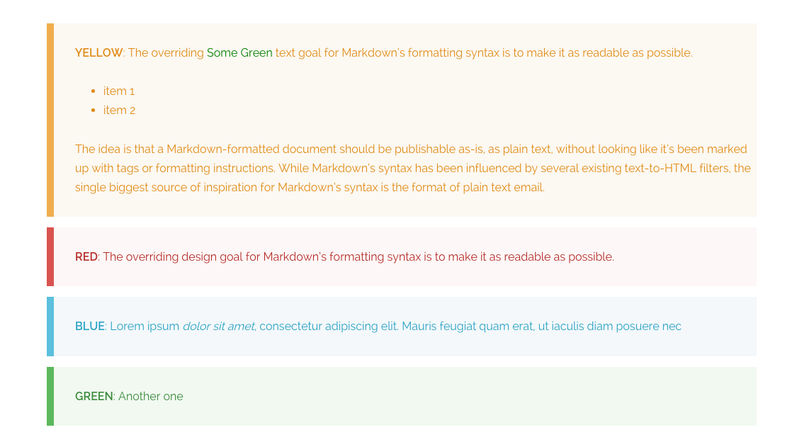

# Grav Markdown Notices Plugin

The **markdown-notices plugin** for [Grav](http://github.com/getgrav/grav) allows generation of notice blocks of text via markdown:



# Installation

This plugin is easy to install with GPM.

```
$ bin/gpm install markdown-notices
```

# Configuration

Simply copy the `user/plugins/markdown-notices/markdown-notices.yaml` into `user/config/plugins/markdown-notices.yaml` and make your modifications.

```
enabled: true
built_in_css: true
level_classes: [yellow, red, blue, green]
```

# Examples

Using one level of `!`

```
! Lorem ipsum dolor sit amet, consectetur adipiscing elit. Mauris feugiat quam erat, ut iaculis diam posuere nec.
! Vestibulum eu condimentum urna. Vestibulum feugiat odio ut sodales porta. Donec sit amet ante mi. Donec lobortis
! orci dolor. Donec tristique volutpat ultricies. Nullam tempus, enim sit amet fringilla facilisis, ipsum ex
! tincidunt ipsum, vel placerat sem sem vitae risus. Aenean posuere sed purus nec pretium.
```

You will output the following HTML

```
<div class="notices yellow">
    <p>
        Lorem ipsum dolor sit amet, consectetur adipiscing elit. Mauris feugiat quam erat, ut iaculis diam posuere nec.
        Vestibulum eu condimentum urna. Vestibulum feugiat odio ut sodales porta. Donec sit amet ante mi. Donec lobortis
        orci dolor. Donec tristique volutpat ultricies. Nullam tempus, enim sit amet fringilla facilisis, ipsum ex
        tincidunt ipsum, vel placerat sem sem vitae risus. Aenean posuere sed purus nec pretium.
    </p>
</div>
```

The `yellow` class is determined by the `level_classes` in the configuration.  You can customize this as you need.

```
!! Lorem ipsum dolor sit amet, **consectetur adipiscing** elit. Mauris feugiat quam erat, ut iaculis diam posuere nec.
!!
!! * List item a
!! * List item b
!!
!! orci dolor. Donec tristique volutpat ultricies. Nullam tempus, enim sit amet fringilla facilisis, ipsum ex
!! tincidunt ipsum, vel placerat sem sem vitae risus. Aenean posuere sed purus nec pretium.
```

Two levels of `!!` will use the second level class etc.  You can also use complex markdown inside the notices.
