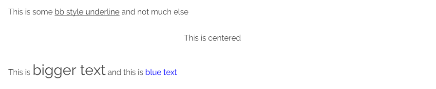

# Grav Shortcode Core Plugin

## About

The **Shortcode Core** plugin allow for the development of simple yet powerful shortcode plugins that utilize the common format utilized by **WordPress** and **BBCode**. The core plugin loads the libraries required and fires a new event that other plugins can use.  It also provides a mechanism for adding CSS/JS assets that are cached so that shortcodes can work effectively even when the processed page content is cached.  This ensures that shortcodes are only processed once and will not impact performance by doing unnecessary work on every page.

This plugin uses the [Thunderer Advanced shortcode engine](https://github.com/thunderer/Shortcode). For more information please check out that repo on GitHub.

## Quick Example

```
This is some [u]bb style underline[/u] and not much else

[center]This is centered[/center]

This is [size=30]bigger text[/size] and this is [color=blue]blue text[/color]
```

This example functionality is provided with the **Shortcode Core** plugin to provide some functionality that is not available in traditional markdown but is standard **BBCode** used in many form platforms.  You can see how the syntax is just a simple open and close element using square brackets.

This will render:



The core plugin required for any other shortcode specific plugin. Provides some basic BBCode style syntax such as underline, color, center, and size.

## Installation

Typically a plugin should be installed via [GPM](http://learn.getgrav.org/advanced/grav-gpm) (Grav Package Manager):

```
$ bin/gpm install shortcode-core
```

Alternatively it can be installed via the [Admin Plugin](http://learn.getgrav.org/admin-panel/plugins)

> NOTE: If you install a shortcode plugin such as [grav-plugin-shortcode-ui](https://github.com/getgrav/grav-plugin-shortcode-ui) it may have this core plugin configured as a dependency and install it automatically.

## Configuration Defaults

The **Shortcode Core** plugin only has a few options to configure.  The default values are:

```yaml
enabled: true
active: true
active_admin: true
parser: regex
custom_shortcodes:
load_fontawesome: false
```

* `enabled: true|false` toggles if the shortcodes plugin is turned on or off
* `active: true|false` toggles if shortcodes will be enabled site-wide or not
* `active_admin: true|false` toggles if shortcodes will be processed in the admin plugin
* `parser: wordpress|regex|regular` let's you configure the parser to use. 
* `custom_shortcodes:` the path to a directory where you can put your custom shortcodes (e.g. `/user/custom/shortcodes`)
* `load_fontawesome: true|false` toggles if the fontawesome icon library should be loaded or not

> NOTE: In previous versions the `wordpress` parser was preferred.  However with version `2.4.0`, the `regex` parser is now default.  If you have saved configuration, you should manually change this to `regex` or you may receive errors or bad output.

## Configuration Modifications

The best approach to make modifications to the core plugin settings is to copy the `shortcode-core.yaml` file from the plugin into your `user/config/plugins/` folder (create it if it doesn't exist).  You can modify the settings there.

> NOTE: If you have the admin plugin installed, you can make modifications to the settings via the **Plugins** page and it will create that overridden file automatically.

## Per-Page Configuration

Sometimes you may want to only enable shortcodes on a _page-by-page_ basis.  To accomplish this set your plugin defaults to:

```yaml
enabled: true
active: false
```

This will ensure the plugin is loaded, but not **active**, then on the page you wish to process shortcodes on simply add this to the page header:

```yaml
shortcode-core:
    active: true
```

This will ensure the shortcodes are processed on this page only.

You can also change the parser on a particular page with the following:

```yaml
shortcode-core:
    parser: regex
```

## Available Shortcodes

The core plugin contains a few simple shortcodes that can be used as basic examples:

#### Underline

Underline a section of text

```
This is some [u]bb style underline[/u] and not much else
```

#### Font Size

Set the size of some text to a specific pixel size

```
This is [size=30]bigger text[/size]
```

#### Left Align

Left align the text between this shortcode

```
[left]This text is left aligned[/left]
```

#### Center Align

Center a selection of text between this shortcode

```
[center]This text is centered[/center]
```

#### Right Align

Right align the text between this shortcode

```
[right]This text is right aligned[/right]
```


#### Div

Allows you to wrap markdown in an HTML `div` tag that supports both `id` and `classes` attributes

```
[div class="text-center"]
This text is **centered** aligned
[/div]
```

or 

```
[div class="table table-striped"]
| header 1 | header 2 |
|----------|----------|
| A 1      | B 1      |
| A 2      | B 2      |
| A 3      | B 3      |
[/div]
```


#### Columns

Take advantage of powerful CSS columns support by using this shortcode

```
[columns]
### Headline

Lorem ipsum dolor sit amet, consectetur adipisicing elit, sed do eiusmod
tempor incididunt ut labore et dolore magna aliqua. Ut enim ad minim veniam,
quis nostrud exercitation ullamco laboris nisi ut aliquip ex ea commodo
consequat. 

Duis aute irure dolor in reprehenderit in voluptate velit esse
cillum dolore eu fugiat nulla pariatur. Excepteur sint occaecat cupidatat non
proident, sunt in culpa qui officia deserunt mollit anim id est laborum.

Lorem ipsum dolor sit amet, consectetur adipisicing elit, sed do eiusmod
tempor incididunt ut labore et dolore magna aliqua. Ut enim ad minim veniam,
quis nostrud exercitation ullamco laboris nisi ut aliquip ex ea commodo
consequat. 
[/columns]
```

Defaults to 2 columns.  You can also explicitly set the number of `columns`, `width`, `gap`, and `rule` styling for the column divider:

```
[columns count=3 width=200px gap=30px rule="1px dotted #930"]
### Headline

Lorem ipsum dolor sit amet, consectetur adipisicing elit, sed do eiusmod
tempor incididunt ut labore et dolore magna aliqua. Ut enim ad minim veniam,
quis nostrud exercitation ullamco laboris nisi ut aliquip ex ea commodo
consequat. 

Duis aute irure dolor in reprehenderit in voluptate velit esse
cillum dolore eu fugiat nulla pariatur. Excepteur sint occaecat cupidatat non
proident, sunt in culpa qui officia deserunt mollit anim id est laborum.

Lorem ipsum dolor sit amet, consectetur adipisicing elit, sed do eiusmod
tempor incididunt ut labore et dolore magna aliqua. Ut enim ad minim veniam,
quis nostrud exercitation ullamco laboris nisi ut aliquip ex ea commodo
consequat. 
[/columns]
```

#### Raw

Do not process the shortcodes between these raw shortcode tags

```
[raw]This is some [u]bb style underline[/u] and not much else[/raw]
```

#### Safe-Email

Encode an email address so that it's not so easily 'scrapable' by nefarious scripts.  This one has a couple of options: `autolink` toggle to turn the email into a link, and an `icon` option that lets you pick a font-awesome icon to prefix the email.  Both settings are optional.

```
Safe-Email Address: [safe-email autolink="true" icon="envelope-o"]user@domain.com[/safe-email] 
```

#### Section

The **section** shortcode is a powerful way to encompass some text in your markdown page with a `[section][/section]` tag and then this is cached by Grav so it can be accessed later.  For example you could have a page with a variety of sections described in it that let you create many **chunks** of data. These are then added to Twig as an array of shortcode objects.  An example of this would be the following markdown:

```
[section name="author"]

### Johnny Appleseed
Johnny Appleseed was an American pioneer nurseryman who introduced apple trees to large parts of Pennsylvania, Ontario, Ohio, Indiana, and Illinois, as well as the northern counties of present-day West Virginia. He became an American legend while still alive, due to his kind, generous ways, his leadership in conservation, and the symbolic importance he attributed to apples.
[/section]

[section name="quote"]
> Some are born great, some achieve greatness, and some have greatness thrust upon them.
  Read more at http://www.brainyquote.com/quotes/topics/topic_great.html#tdqt3strtEYBCH43.99
> <cite>William Shakespeare</cite>

Regular **Markdown** content that will be output as `page.content`
[/section]
```

This we be removed from the page content and made available in Twig variables so you could insert these into custom HTML structures, for example:

```
<div id="author">{{ shortcode.section.author }}</div>

<div id="article">
    <div class="left">
        {{ page.content }}
    </div>
    <div class="right">
        {{ shortcode.section.quote }}
    </div>
</div>
```

#### Sections from other pages   
    
You can even retrieve a section from another page utilizing the shortcodes as they are stored in the page's `contentMeta` with this syntax:
    
```
<div id="author">{{ page.find('/my/custom/page').contentMeta.shortcodeMeta.shortcode.section.author }}</div>
```

#### Notice

A useful shortcode that performs a similar job to the [markdown-notices](https://github.com/getgrav/grav-plugin-markdown-notices) plugins, allows you to easily create simple notice blocks as seen on http://learn.getgrav.org and http://getgrav.org.  To use simply use the following syntax:

```
[notice]
Your **Markdown** text that will appear in the notice
[/notice]
```

You can also specifically choose from `note`, `info`, `warning`, `tip` types which provide unique color options:

```
[notice=warning]
Danger Will Robinson! Danger, Will Robinson!
[/notice]
```

#### FontAwesome

[FontAwesome](https://fortawesome.github.io/Font-Awesome/) is a powerful library of font-based icons.  This shortcode makes it simple to add fontawesome icons to your page content without using HTML.

[fa=cog /] Simplest Format

[fa=fa-cog /] Format using `fa-` prefix

[fa icon=fa-camera-retro /] Explicit format

[fa icon=fa-camera-retro extras=fa-4x /] Explicit format with extras - [See FontAwesome Examples](https://fortawesome.github.io/Font-Awesome/examples/)

[fa icon=fa-circle-o-notch extras=fa-spin,fa-3x,fa-fw,margin-bottom /] The full monty! - [See FontAwesome Examples](https://fortawesome.github.io/Font-Awesome/examples/)

## Using Shortcodes in Twig

You can now use shortcodes in Twig templates and process them with the `|shortcodes` filter. For example:

```

{{ twig_text|shortcodes }}
```

## Developing Shortcode Plugins

The **Shortcode Core** plugin is developed on the back of the [Thunderer Advanced Shortcode Engine](https://github.com/thunderer/Shortcode) and as such loads the libraries and classes required to build third party shortcode plugins.  Also we introduce a new event called `onShortcodeHandlers()` that allows a 3rd party plugin to create and add their own custom handlers.  These are then all processed by the core plugin in one shot.

> If you have not already done so, I suggest reading the [Grav Plugin Tutorial](http://learn.getgrav.org/plugins/plugin-tutorial) first to gain a full understanding of what you need to develop a Grav plugin.

The best way to see how to create a new shortcode-based plugin is to look at the **Shortcode UI** plugin that extends the **Shortcode Core** by adding more shortcodes.  It also makes use of Twig to handle processing and has some more advanced shortcode techniques.

* Core Plugin: https://github.com/getgrav/grav-plugin-shortcode-ui/blob/develop/shortcode-ui.php
* Tabs Shortcode Example: https://github.com/getgrav/grav-plugin-shortcode-ui/blob/develop/shortcodes/TabsShortcode.php
* Color Shortcode Example: https://github.com/getgrav/grav-plugin-shortcode-core/blob/develop/shortcodes/ColorShortcode.php
* Section Shortcode Example: https://github.com/getgrav/grav-plugin-shortcode-core/blob/develop/shortcodes/SectionShortcode.php
